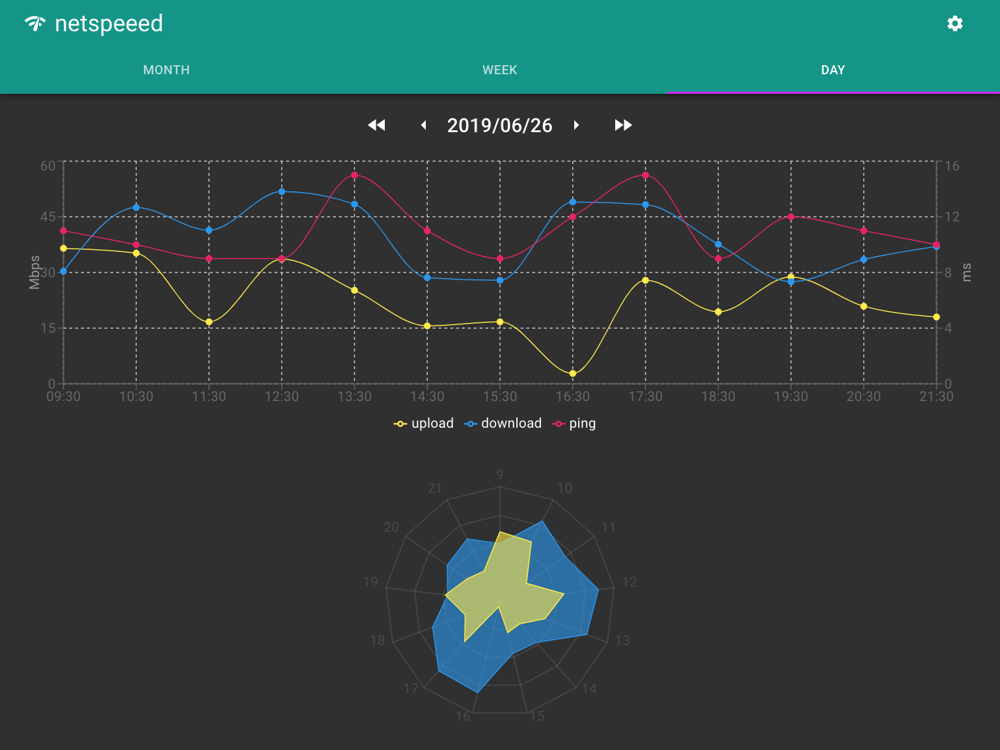

# netspeeed

Continuously measure and visualize the home internet speed.



## Requirements

- Device connected to the Internet and always up (I use Raspberry Pi).
- [serverless](https://serverless.com) development environment (with your AWS account)
- [Node.js](https://nodejs.org/ja/) development environment

## Usage

1. Build an API server on AWS Lambda.
2. Create a Docker container that keeps measuring the internet speed.
3. Access dashboard.

### 1. Build an API server on AWS Lambda

```sh
git clone https://github.com/m5d215/netspeeed.git
cd netspeeed

yarn install
sls deploy
```

When deployment is successful, the API endpoint is output.

In the following example, `https://dyvx8cypcq.execute-api.ap-northeast-1.amazonaws.com/dev` is the API endpoint.

```text
endpoints:
  POST - https://dyvx8cypcq.execute-api.ap-northeast-1.amazonaws.com/dev/users/{user}/netspeeed
  GET - https://dyvx8cypcq.execute-api.ap-northeast-1.amazonaws.com/dev/users/{user}/netspeeed
```

### 2. Create a Docker container that keeps measuring the internet speed

After building the Docker image, start the Docker container in the background.

```sh
git clone https://github.com/m5d215/netspeeed.git
cd netspeeed/client

docker image build -t m5d215/netspeeed:client .

# ⚠️ Change environment variables according to your own environment.
docker container run \
    -d \
    --name netspeeed-client \
    -e NETSPEEED_USER='m5d215' \
    -e CRON='30 * * * *' \
    -e API_URL='https://dyvx8cypcq.execute-api.ap-northeast-1.amazonaws.com/dev' \
    m5d215/netspeeed:client
```

### 3. Access dashboard

1. Open <https://netspeeed.now.sh> from your Browser.
2. Click the gear icon in the upper right and enter the server information. For example:
    - **API endpoint:** `https://dyvx8cypcq.execute-api.ap-northeast-1.amazonaws.com/dev`
    - **User:** `m5d215`
